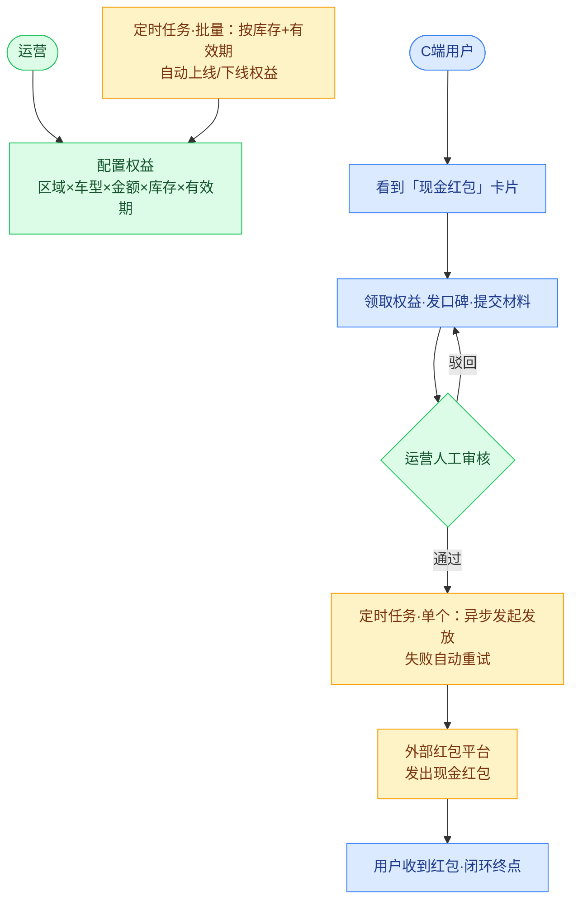
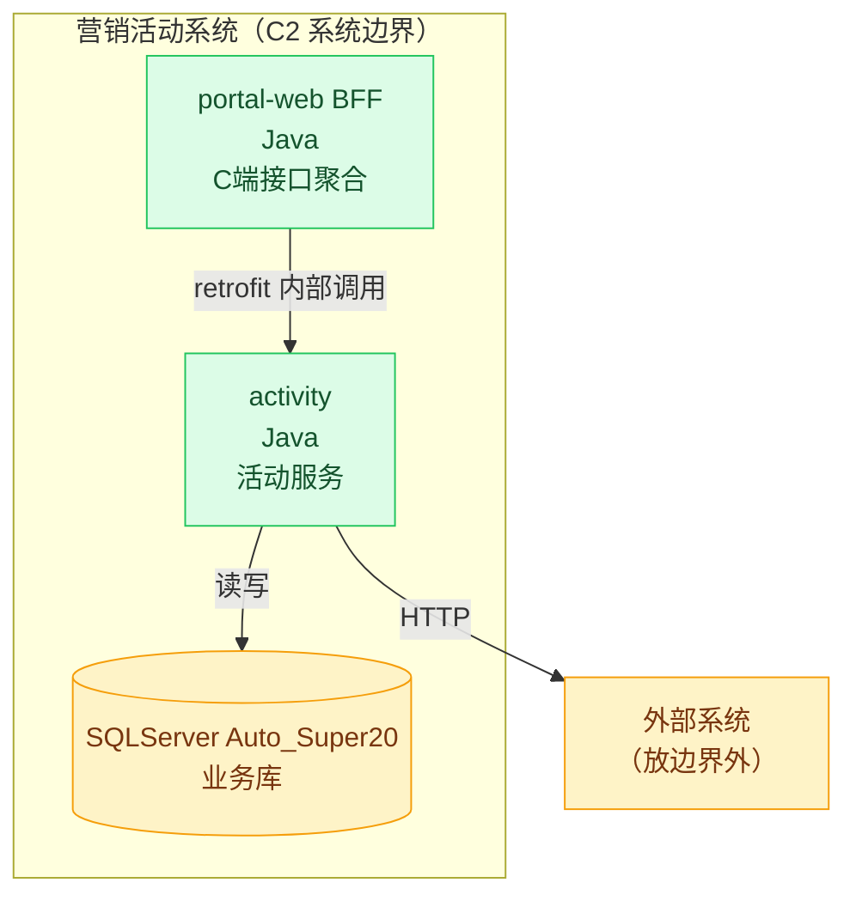
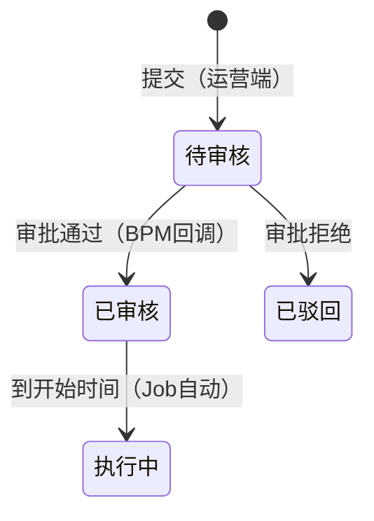
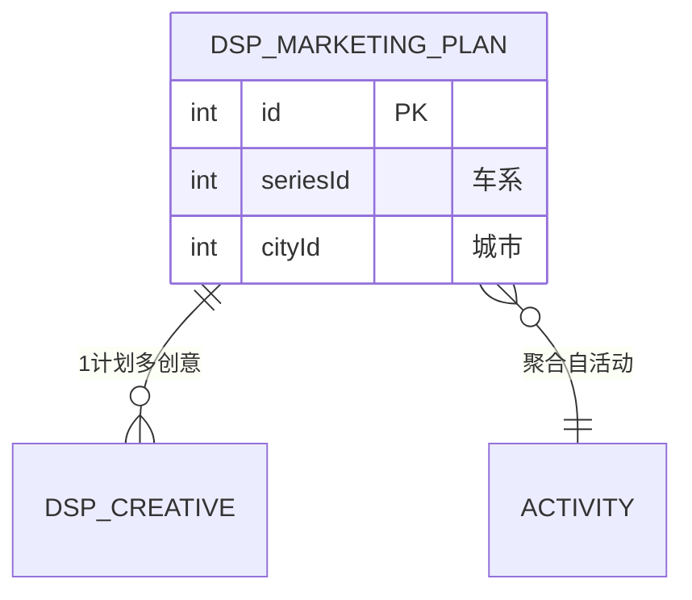
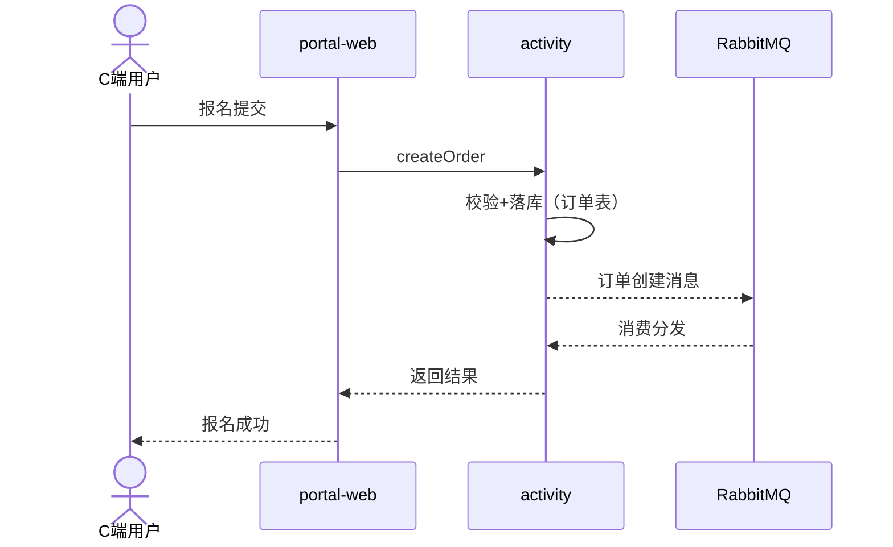

# 模块文档（<短英文名>.md）六部分模板

写法总纲：**结构照抄本模板，内容全部来自实证**。占位符 `{module}`/`{domain}`/`{name}`。标题只允许 1/2/3 级（门禁校验），全文恰好 1 个一级标题。关键断言后括号挂源码锚点（`类名#方法` 或 `文件:行`）。

---

````markdown
# {module}

> 域：{domain} ｜ 涉及应用：{应用全名清单} ｜ 生成：YYYY-MM-DD ｜ 事实源：{name}.json

## 一、概述

### 这是什么系统

（2~4 句：系统定位、服务谁、核心价值。首句必须与同名 json 的 summary 一致——一句话口径跨文件统一。）

goodcase（风格参照，商广剩余流量对接）：
> 把报名中且有全年C端补贴的活动按车系×城市聚合，通过 SmartAdApi（gateway，之家商业广告/DSP 平台）创建营销计划（Campaign）+ 广告创意（Creative），投放到商广剩余流量广告位，落地到团购专题/QL 页承接线索。

### 业务边界

- 管理什么：<...>
- 不管理什么：<...>（划清边界，避免 AI 越界假设；模块相关但归属别处的能力在此写明归属）

### 核心业务链路（一句话）

（用一句话串起主流程，如：录入 → 开票 → 收款）

### 核心业务对象

| 对象 | 说明 |
|------|------|
| <对象A> | <一句话> |

### 特殊澄清（可选，业务命名与代码命名口径不一致时必写）
> 业务命名口径为「商广剩余流量」，代码层全部以 DSP/SmartAd 命名（service/dsp 包、SmartAdApi、DspMarketing* 表），两套叫法同一套代码。

## 二、功能点与流程

### 2.1 业务流程图

（mermaid flowchart，**角色协作视角，不是系统架构视角**。先答三问再画：涉及哪些角色（人）？每个角色做什么任务？角色之间怎么联系？）

铁律（必须）：

- **主体只允许三类：人/角色、外部系统、定时任务**。禁止出现内部系统名（应用/BFF/服务）、表名、Redis/MQ/接口路径/Job 类名——系统怎么调用、数据落哪，属于 3.1 C4 与 3.4 数据流图，2.1 不重复。
- **Job 一律写「定时任务·批量/单个：做xx」**：批量=定时扫描处理一批，单个=按单异步处理；不写 Job 类名。
- **外部系统保留为节点**（如 auto-pay/线索中台/ICS/外部 CPS），与定时任务同色；外部参与方是有业务身份的「人」时按角色画（如厂商、经销商顾问）。



颜色纪律（必须）：一张图 ≤3 色，语义固定——**蓝=用户/厂商/顾问等参与方、绿=运营等内部人员、黄=定时任务与外部系统**。节点=业务动作（动词开头），边=业务流转，分叉/驳回用边标签，兜底/异步触达用虚线。

### 2.2 能力清单

| 端 | 功能点 | 说明 |
|---|---|---|
| 管理后台 | xxx管理 | 运营可以…（完成了xxx） |
| 用户端 | xxx | 用户做xxx |
| 定时任务 | xxxJob | 完成了xxx处理 |

端取值：管理后台 / 用户端（C端页面+BFF）/ 服务层 / 定时任务 / MQ消费 / 外部系统。说明用用户视角动词开头，不用技术黑话。

### 2.3 依赖能力列表（可选）

| 所属 | 能力 | 提供什么 |
|---|---|---|
| 中台 | OCR识别接口 | 提供ocr识别发票能力 |

（对应 json 的 third_party_apis；工作区内项目互调也列此处并注明"工作区内"，三方与内部用归属列区分。）

## 三、系统关键设计

### 3.1 C4 架构图

C1 粒度=营销活动整个系统（System Context），C2 粒度=各应用（Container）。**C1 只有 1 个系统时可豁免，只画 C2 并在此说明**。

> **禁用 mermaid 的 C4Context/C4Container/C4Dynamic 原生语法**——该语法族在 mermaid 11+ 已整体移除，渲染必报 Syntax error。一律用 flowchart 等价视图表达：`subgraph`=系统边界、节点=容器（数据库用圆柱形 `[("...")]`、外部系统放边界外），图题标注层级（C1/C2），并在图前加一行说明。



### 3.2 状态机与审批流

（模块含状态字段或审批环节时必须画，json features 如实标记，门禁查图。）



状态机/审批流必须附状态枚举表（code/枚举名/含义/谁触发），风格参照 `knowledge/_manual/zhudian/module-workorder.md` 第三节。审批流与状态机是两条线就画两张图。

### 3.3 数据库 ER 图



只画本模块核心表与关系（json tables 全集在第五部分清单，不必全塞进图）。

### 3.4 数据流图

```mermaid
flowchart LR
    A1[/api 入口] --> SVC[activity] --> T[(表)]
    A2[MQ 消费] --> SVC
    J[Job 定时] --> T2[(表/Redis)] --> J2[出口 Job] -.-> MQ2[[MQ]] --> EXT[外部API]
```

答清三问：数据从哪些入口进 → 落在哪些应用与表 → 哪些定时任务读走、发给哪些 MQ/API。与 2.1 的区别：2.1 讲角色协作，3.4 只讲数据流动。

### 3.5 核心功能闭环时序图

选**最核心的一个功能点**做成闭环：



用 alt/opt 标异常分支；至少覆盖一条完整往返（触发→处理→落库→后置动作→反馈）。

## 四、技术架构分析

### 4.1 优点

- **设计模式**：用了哪些、落在哪（类名+一段"为什么"），如"策略模式：CpsSubsidyTypeEnum 每类型一个实现，新增补贴类型只需加类"
- **可扩展性**：新增一类处理要不要改老代码？只加类还是要动 if-else？

### 4.2 缺点（四问必查，每条挂代码证据，查不到证据的缺陷不写）

- **缓存一致性**：先更库还是先删缓存？过期策略？
- **幂等性**：MQ 重复消费/接口重试会不会重复落库？
- **事务边界**：数据库事务里有没有 MQ 发送和 RPC 调用（悬挂/不一致风险）？
- **安全**：角色权限、数据权限有没有缺失（接口裸奔/越权）？

### 4.3 技术债务总结

| 问题 | 影响 | 优化建议 | 优先级 |
|---|---|---|---|

四问都干净的项写「未发现（依据：xxx）」，不许留空假冒查过。

## 五、知识清单

> 清单计数：API {n} · Job {n} · 表 {n} · Redis {n} · Apollo {n} · MQ {n} —— 与 {name}.json 逐项对账

（上面这行是固定格式对账行，数字必须等于 json 对应数组长度。以下 6 张表**从 json 渲染**，禁止脱离 json 手写。某类目为空数组时：保留小节标题，正文写一句「无（已实证：grep <方式> 无命中）」并省略空表格——空=明确声明"无"，不是留白没查。）

### 5.1 功能入口 API

| 应用 | Controller#方法 | HTTP | 路径 | 作用 |
|---|---|---|---|---|

### 5.2 定时任务 Job

| 应用 | 类#方法 | cron | 作用 |
|---|---|---|---|

### 5.3 Redis Key

| Key 模式 | 应用 | 用途 |
|---|---|---|

### 5.4 Apollo Key

| Key | 应用 | 用途 |
|---|---|---|

### 5.5 数据库表

| 表 | 应用 | 读/写 | 用途 |
|---|---|---|---|

### 5.6 MQ

| 队列/交换机 | 方向 | 应用 | 用途 |
|---|---|---|---|

## 六、测试问题集

用途：先盲答再展开核对参考答案，验证对本文档/源码的掌握度；代码变更后按题回归。问题持续追加，参考答案锚点均指向本文对应小节。

Q1. （考口径与字段来源的问题，如：品牌维度的 PMO 任务，怎么拆到活动维度？dealerId 和城市分别是怎么设置的？）
<details><summary>参考答案（锚点 §x.y）</summary>

（答案正文，必须能在本文对应小节找到依据）
</details>

出题纪律：3-6 题；考"文档知识是否准确"（字段哪来的 / 两个通道的区别 / 怎么看出是系统建的），不考背诵数字；每题答案锚定本文小节；可在一级问题下附「延伸自测」二级问题（考迁移推理，防背题）。
````

---

## 交付前质量检查清单

- [ ] 结构：恰好 1 个 h1；标题全部 ≤3 级；六部分齐全且顺序不可变；概述四小节（这是什么系统/业务边界/核心业务链路/核心业务对象）齐全
- [ ] 一致性：「这是什么系统」首句 = json summary；清单计数行 = json 数组长度；术语全文统一（同一概念不换叫法）
- [ ] 实证：所有端点/Job/表/Key 断言过门禁；关键设计断言挂源码锚点
- [ ] 图：2.2 流程图 ≤3 色；3.3 ER、3.4 数据流、3.5 时序图在；有状态机必有 stateDiagram；C4 有或豁免有说明
- [ ] 兼容性：所有 mermaid 只用 11+ 仍存的核心语法（flowchart/stateDiagram-v2/erDiagram/sequenceDiagram）；C4 族原生语法已被 mermaid 11 移除，一律 flowchart 等价视图（门禁会 FAIL）
- [ ] 跨文档：本域既有文档的同类口径已 grep 核对无矛盾
- [ ] 跨平台：全文无 `D:/`、`C:\` 等平台专属绝对路径（源码锚点用相对路径）
- [ ] 适用性：复杂概念有示例；关键决策写了理由；技术细节足以支撑维护
